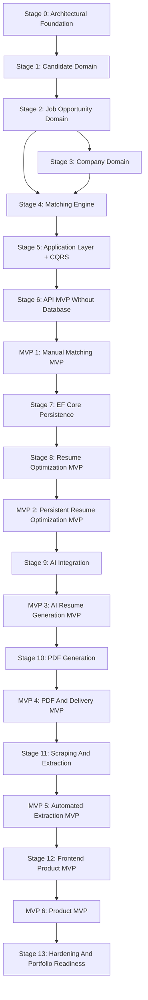
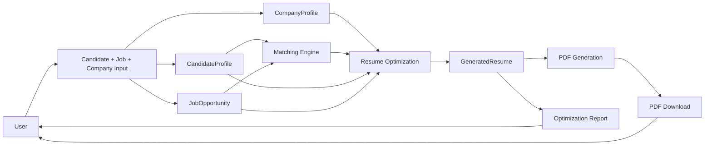
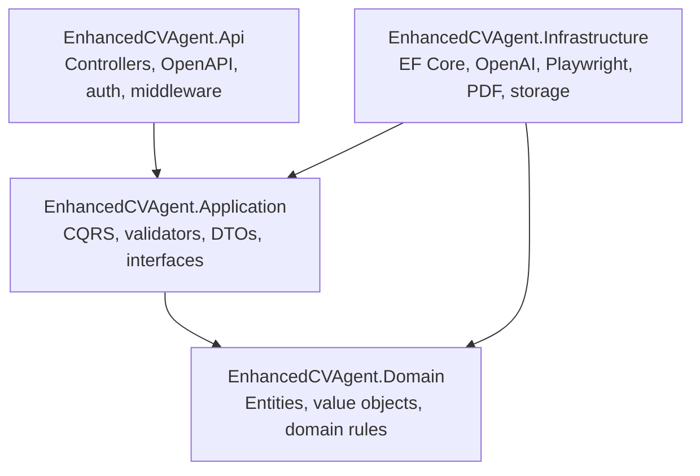

# EnhancedCVAgent Project Roadmap

This document defines the fixed delivery path for EnhancedCVAgent. The goal is to evolve the project incrementally while preserving Clean Architecture, DDD, CQRS, EF Core, testability, and a clear separation between domain rules and external integrations.

## Current Baseline

The project currently has the expected high-level structure:

```text
src/
  EnhancedCVAgent.Api/
  EnhancedCVAgent.Application/
  EnhancedCVAgent.Domain/
  EnhancedCVAgent.Infrastructure/

tests/
  EnhancedCVAgent.UnitTests/
  EnhancedCVAgent.IntegrationTests/
```

The `Domain` layer already contains early modeling for:

- `CandidateProfile`
- `JobOpportunity`
- candidate value objects such as `Skill`, `Experience`, `Education`, `Language`, and `Certification`
- matching-related concepts such as `MatchScore`
- company culture concepts such as `CompanyCultureTrait`

The next priority is to finish the domain model and only then move into CQRS, persistence, AI, PDF, scraping, and frontend.

## Delivery Principles

- Build by vertical increments, but keep the architectural boundaries from the beginning.
- Do not call AI, scraping, EF Core, or PDF generation from the domain layer.
- Keep the base candidate profile separate from generated resumes.
- Prefer manual input before automation. Manual job description first, scraping later.
- Prefer deterministic matching before AI-powered optimization.
- Every stage must have a clear "definition of done" before moving forward.

## Stage 0: Architectural Foundation

**Goal:** make the project structure clean and ready for long-term development.

**Scope:**

- Solution organization.
- Project references.
- Empty template cleanup.
- Base dependency direction.
- Shared conventions.

**Main Points:**

- `Domain` must not depend on any other project.
- `Application` depends on `Domain`.
- `Infrastructure` depends on `Application` and `Domain`.
- `Api` depends on `Application` and `Infrastructure`.
- Remove placeholder files such as `Class1.cs` and template tests.
- Keep namespaces aligned with folders.

**Deliverables:**

- Clean solution structure.
- Valid project references.
- No unused template classes.
- Initial documentation under `docs/`.

**Definition Of Done:**

- Solution builds successfully.
- Dependency direction follows Clean Architecture.
- No business logic exists in `Api`.
- No infrastructure code exists in `Domain`.

## Stage 1: Candidate Domain

**Goal:** finish `CandidateProfile` as a reliable aggregate root.

**Scope:**

- `CandidateProfile`
- `Skill`
- `Experience`
- `Education`
- `Language`
- `Certification`

**Main Points:**

- Candidate profile is the source of truth for the candidate.
- Generated resumes must not mutate the base candidate profile.
- Collections must be internally mutable and externally read-only.
- Value objects must be immutable after creation.
- Add methods should validate null input and protect invariants.
- Remove methods should only be added when a real use case requires them.

**Deliverables:**

- Candidate aggregate with protected internal collections.
- Candidate value objects with validation.
- Unit tests for candidate creation and invalid input.

**Definition Of Done:**

- `CandidateProfile` cannot be created with invalid required fields.
- Skills cannot be duplicated in the same profile.
- Experiences, education, languages, and certifications cannot be added as null.
- Unit tests cover the main invariants.

## Stage 2: Job Opportunity Domain

**Goal:** model the job opportunity as a structured domain concept.

**Scope:**

- `JobOpportunity`
- `JobSkillRequirement`
- `JobResponsibility`
- `JobQualification`
- `RequirementType`
- `SeniorityLevel`
- `WorkMode`
- `EmploymentType`

**Main Points:**

- `JobOpportunity` represents the vacancy, not the scraping process.
- Raw job description should be preserved for traceability.
- Technical requirements should not remain as plain strings.
- Required and preferred skills should be represented by requirement metadata instead of duplicate classes.
- Responsibilities are different from skills and should be modeled separately.
- Extraction confidence and evidence can be introduced when AI/scraping starts.

**Recommended Conceptual Shape:**

```text
JobOpportunity
  Url
  Title
  CompanyName
  Description
  SeniorityLevel
  WorkMode
  EmploymentType
  ExtractedAt
  SkillRequirements
  Responsibilities
  Qualifications
```

**Deliverables:**

- Job opportunity aggregate or entity with constructor validation.
- Structured value objects for requirements and responsibilities.
- Unit tests for invalid vacancy data.
- Unit tests for adding skill requirements and responsibilities.

**Definition Of Done:**

- A job can be represented from manual input.
- Required and preferred skills are distinguishable.
- Responsibilities are structured.
- The model is ready to receive data from future scraping or AI extraction.

## Stage 3: Company Domain

**Goal:** represent company culture and positioning independently from job opportunity.

**Scope:**

- `CompanyProfile`
- `CompanyCultureTrait`
- `CompanyValue`
- `CompanyTone`

**Main Points:**

- Company culture belongs to the company context, not the candidate context.
- The company profile should support manual input before scraping.
- Culture traits should include intensity and confidence.
- The domain should allow incomplete company data because scraping may fail.

**Deliverables:**

- Company profile entity.
- Company culture value objects.
- Unit tests for culture trait validation.

**Definition Of Done:**

- Company profile can represent company name, URL, mission, values, and culture traits.
- Culture traits are validated.
- Company data can be used later by resume optimization without coupling to scraping.

## Stage 4: Matching Engine

**Goal:** compare candidate profile against a job opportunity using deterministic rules first.

**Scope:**

- `MatchScore`
- `SkillMatch`
- `MissingSkill`
- `MatchingReport`
- Matching domain service or application service.

**Main Points:**

- Matching should start simple and deterministic.
- AI should not be required for the first matching version.
- Required skills should have more weight than preferred skills.
- The result should explain why the score was calculated.

**Initial Rules:**

- Exact skill match increases score.
- Missing required skill reduces score more heavily.
- Missing preferred skill reduces score lightly.
- Candidate skill level can influence score.
- Responsibilities can be used later to score experience relevance.

**Deliverables:**

- Matching result model.
- Deterministic matching service.
- Unit tests for score calculation.

**Definition Of Done:**

- The system can produce a technical match score.
- The system can list missing required and preferred skills.
- The matching output is explainable.
- Main score scenarios are covered by tests.

## Stage 5: Application Layer And CQRS

**Goal:** introduce use cases through commands, queries, handlers, validators, and DTOs.

**Scope:**

- MediatR.
- FluentValidation.
- Commands.
- Queries.
- DTOs.
- Application interfaces.

**First Use Cases:**

```text
CreateCandidateProfileCommand
CreateJobOpportunityCommand
CalculateCandidateJobMatchCommand
GetCandidateProfileByIdQuery
GetJobOpportunityByIdQuery
```

**Main Points:**

- Controllers should delegate to MediatR.
- Application layer should orchestrate use cases.
- Application layer defines interfaces for persistence and external integrations.
- Application layer must not depend on EF Core, OpenAI, Playwright, or PDF libraries.

**Deliverables:**

- Command and query structure.
- Validators.
- Handler tests with mocks.
- Application abstractions for repositories.

**Definition Of Done:**

- Use cases can be executed from tests.
- Invalid application input is rejected by validators.
- Domain invariants remain inside domain objects.

## Stage 6: API MVP Without Database

**Goal:** expose the first usable backend flow without persistence complexity.

**Scope:**

- Real API controllers.
- OpenAPI/Swagger.
- Request and response contracts.
- In-memory application flow if needed.

**Endpoints:**

```text
POST /api/candidate-profiles
POST /api/job-opportunities
POST /api/matches
```

**Main Points:**

- Remove weather forecast template code.
- Controllers should stay thin.
- API should expose a complete manual MVP flow.
- No scraping, AI, PDF, or EF Core yet.

**Deliverables:**

- Candidate profile endpoint.
- Job opportunity endpoint.
- Match calculation endpoint.
- Basic API tests if practical.

**Definition Of Done:**

- User can submit a candidate profile.
- User can submit a job description manually.
- User can receive a match report.
- API has no business rule duplication.

## Stage 7: Persistence With EF Core

**Goal:** persist the core domain data.

**Scope:**

- SQL Server.
- EF Core.
- `EnhancedCvDbContext`.
- Entity configurations.
- Migrations.
- Repository implementations.

**Main Points:**

- Map aggregates carefully.
- Value objects can be mapped as owned entities where appropriate.
- Keep EF configuration in `Infrastructure`.
- Keep repository interfaces in `Application`.
- Integration tests should cover persistence behavior.

**Deliverables:**

- Database context.
- Entity configurations.
- Initial migration.
- Repository implementations.
- Integration tests.

**Definition Of Done:**

- Candidate profiles can be persisted and loaded.
- Job opportunities can be persisted and loaded.
- Matching results can be associated with candidate and job data.
- Integration tests validate persistence mappings.

## Stage 8: Resume Optimization MVP

**Goal:** generate a tailored resume version from a candidate and a job opportunity.

**Scope:**

- `ResumeOptimizationRun`
- `GeneratedResume`
- `OptimizationStatus`
- Resume sections.
- Optimization report.

**Main Points:**

- Do not mutate `CandidateProfile` when optimizing.
- Generated resume is an output artifact tied to a specific job.
- First optimization can be deterministic or template-based.
- Store the explanation of what changed and why.

**Deliverables:**

- Resume optimization execution model.
- Generated resume model.
- Application command for creating an optimization run.
- Basic Markdown/text resume generation.

**Definition Of Done:**

- User can generate a text resume version for a specific job.
- Optimization run is persisted.
- Generated resume is linked to candidate and job.
- Output includes a basic explanation.

## Stage 9: AI Integration

**Goal:** use AI to improve resume generation while preserving architectural boundaries.

**Scope:**

- `IAiResumeOptimizer`.
- Prompt templates.
- Structured AI output.
- Retry and fallback strategy.
- AI response validation.

**Main Points:**

- AI integration belongs in `Infrastructure`.
- Interface belongs in `Application`.
- AI should return structured data, not uncontrolled free text only.
- AI output must be validated before becoming persisted application data.
- Prompt design should be versioned and testable.

**Deliverables:**

- AI optimizer interface.
- Infrastructure implementation.
- Prompt templates.
- Application handler integration.
- Tests using mocked AI responses.

**Definition Of Done:**

- AI can generate adapted summary and experience bullets.
- AI failure has a controlled fallback.
- Invalid AI output is rejected or corrected.
- No direct AI dependency exists in `Domain` or `Api`.

## Stage 10: PDF Generation

**Goal:** export generated resumes as professional PDF documents.

**Scope:**

- `IPdfGenerator`.
- PDF template.
- PDF storage path.
- Download endpoint.

**Main Points:**

- PDF generation belongs in `Infrastructure`.
- Generated resume content should be independent from PDF layout.
- The PDF should be generated from structured resume content.
- API should expose download access.

**Deliverables:**

- PDF generator abstraction.
- PDF implementation.
- PDF download endpoint.
- Integration test or smoke test for generation.

**Definition Of Done:**

- A generated resume can be exported as PDF.
- PDF file path or storage reference is persisted.
- API can return/download the PDF.

## Stage 11: Scraping And Extraction

**Goal:** automate job and company data extraction from URLs.

**Scope:**

- `IJobOpportunityExtractor`.
- `ICompanyProfileExtractor`.
- Playwright implementation.
- Raw extracted content.
- Extraction status and errors.

**Main Points:**

- Scraping belongs in `Infrastructure`.
- Domain should receive structured data, not HTML.
- Store raw extracted text for audit/debug.
- Manual fallback must remain available.
- Timeouts, blocked pages, removed jobs, and invalid pages must be handled.

**Deliverables:**

- Job URL extraction flow.
- Company URL extraction flow.
- Extraction result model.
- Error handling and fallback.

**Definition Of Done:**

- User can provide a job URL.
- System extracts useful raw text.
- System creates or updates `JobOpportunity` from extracted data.
- Scraping failure returns a clear status and does not break the workflow.

## Stage 12: Frontend Product MVP

**Goal:** make the system usable without Swagger or direct API calls.

**Scope:**

- Candidate profile creation.
- Job opportunity input.
- Match report screen.
- Resume optimization screen.
- PDF download.
- Optimization history.

**Main Points:**

- Build the tool first, not a marketing landing page.
- Main flow should be direct: candidate profile, job input, match, optimization, PDF.
- Explanations should show what changed and why.
- UI should support repeated use and comparison between opportunities.

**Deliverables:**

- Working frontend application.
- End-to-end manual flow.
- PDF download from UI.
- Basic history view.

**Definition Of Done:**

- User can complete the main flow from the UI.
- User can inspect score and missing skills.
- User can generate and download a resume PDF.

## Stage 13: Hardening And Portfolio Readiness

**Goal:** make the project presentable as a serious engineering portfolio project.

**Scope:**

- Logging.
- Error handling middleware.
- Observability.
- Authentication if needed.
- CI pipeline.
- Docker.
- Documentation.
- Seed/demo data.

**Main Points:**

- Add structured logs.
- Add global exception handling.
- Add health checks.
- Add CI test execution.
- Document local setup and architecture.
- Create demo scenario that shows the full product value.

**Deliverables:**

- Updated README.
- Architecture documentation.
- Local run guide.
- CI pipeline.
- Demo data.
- Docker Compose for local dependencies.

**Definition Of Done:**

- New developer can run the project from documentation.
- Tests run in CI.
- Demo flow can be reproduced.
- Architecture decisions are documented.

## MVP Definitions

### MVP 1: Manual Matching MVP

**Goal:** prove the domain and matching logic.

Includes:

- Candidate profile manual input.
- Job opportunity manual input.
- Deterministic match score.
- Missing skills report.
- API endpoints.

Excludes:

- EF Core persistence.
- AI.
- PDF.
- Scraping.
- Frontend.

### MVP 2: Persistent Resume Optimization MVP

**Goal:** persist data and generate a tailored text resume.

Includes:

- EF Core persistence.
- Candidate and job storage.
- Resume optimization run.
- Generated resume in text or Markdown.
- Basic explanation report.

Excludes:

- AI production integration.
- PDF.
- Scraping.
- Frontend.

### MVP 3: AI Resume Generation MVP

**Goal:** use AI for practical resume tailoring.

Includes:

- AI optimizer abstraction and implementation.
- Structured AI output.
- Adapted professional summary.
- Adapted experience bullets.
- Validation and fallback.

Excludes:

- Scraping as mandatory input.
- Advanced frontend.

### MVP 4: PDF And Delivery MVP

**Goal:** produce a professional artifact.

Includes:

- PDF generation.
- Download endpoint.
- Stored generated resume.
- Stored PDF reference.

### MVP 5: Automated Extraction MVP

**Goal:** accept URLs and extract job/company context.

Includes:

- Job URL scraping.
- Company URL scraping.
- Raw extraction storage.
- Extraction failure handling.
- Manual fallback.

### MVP 6: Product MVP

**Goal:** complete the product experience.

Includes:

- Frontend.
- Candidate profile management.
- Job input by text or URL.
- Match report.
- Resume generation.
- PDF download.
- History.

## High-Level Flowchart



## Runtime Flow Target



## Layer Ownership



## Recommended Immediate Backlog

1. Finish Stage 0 cleanup.
2. Finish Stage 1 tests for `CandidateProfile`.
3. Refine `JobOpportunity` and replace string lists with value objects.
4. Add enums for seniority, work mode, employment type, and requirement type.
5. Implement deterministic matching.
6. Create first Application commands and validators.
7. Expose the first API MVP.

